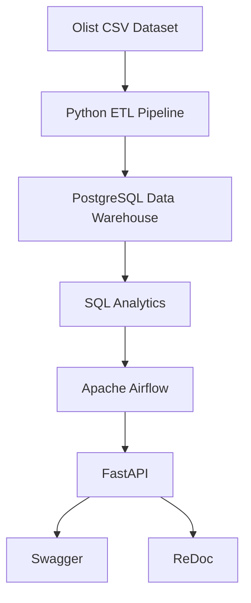
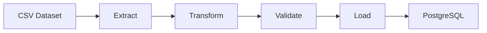
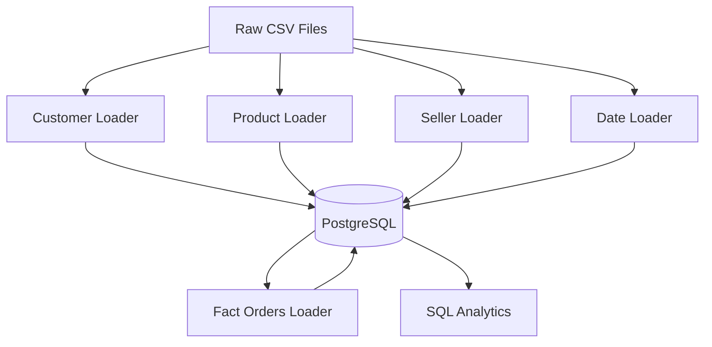
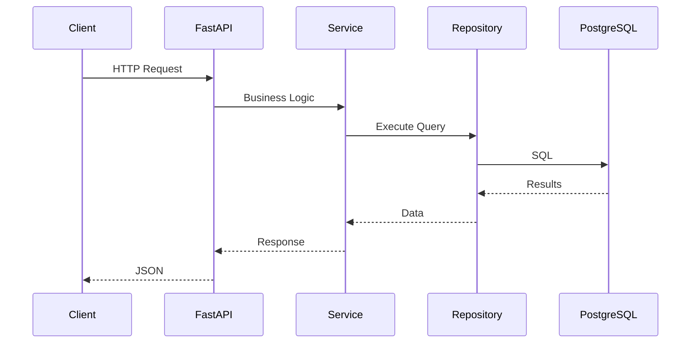
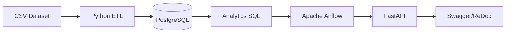

<div align="center">

# 🚀 CommerceFlow

### Production-Inspired Data Engineering Platform

*Building an end-to-end modern Data Engineering pipeline using Python, PostgreSQL, Apache Airflow, Docker, SQL Analytics, and FastAPI.*

---


</div>

---

# 📖 Overview

CommerceFlow is a **production-inspired Data Engineering platform** built using real-world engineering practices.

The project demonstrates how raw e-commerce data can be transformed into a modern analytics platform through ETL pipelines, dimensional modeling, workflow orchestration, SQL analytics, and REST APIs.

Unlike a traditional CRUD application, CommerceFlow focuses on **data engineering architecture**, emphasizing scalability, modularity, automation, and analytics.

The project simulates how modern organizations ingest operational data, transform it into analytical datasets, orchestrate workflows using Apache Airflow, and expose business insights through FastAPI.

---

# 🎯 Project Objectives

The primary goal of CommerceFlow is to demonstrate production-ready Data Engineering concepts including:

- Building reusable ETL pipelines
- Designing a dimensional data warehouse
- Workflow orchestration using Apache Airflow
- Business analytics using SQL
- REST API development with FastAPI
- Dockerized infrastructure
- Modular software architecture
- Production-inspired project organization

---

# ✨ Key Features

## 📦 Data Warehouse

- Star Schema Design
- Fact & Dimension Tables
- Optimized SQL Queries
- Primary & Foreign Keys
- Indexing Strategy

---

## ⚡ ETL Pipeline

- Modular ETL Architecture
- Batch Processing
- Data Validation
- Logging
- Error Handling
- Incremental Design
- Reusable Base Loader

---

## 📊 Analytics Layer

Business KPIs including:

- Revenue Analytics
- Customer Analytics
- Product Analytics
- Seller Analytics
- Geographic Analytics
- Operational Analytics
- Executive Dashboard KPIs

---

## ⏰ Workflow Orchestration

Using Apache Airflow:

- DAG-based pipeline
- Sequential ETL execution
- Automated Analytics
- Scheduler
- Retry Policies
- Monitoring

---

## 🌐 REST API

FastAPI powered analytics service.

Includes:

- Health Endpoint
- Revenue APIs
- Product APIs
- Customer APIs
- Geographic APIs
- Dashboard APIs

Interactive Documentation:

- Swagger UI
- ReDoc

---

## 🐳 Dockerized Infrastructure

Every component runs inside Docker.

Containers include:

- PostgreSQL
- Apache Airflow Scheduler
- Apache Airflow Webserver
- Airflow Init Service

---

# 🛠 Technology Stack

| Category | Technologies |
|-----------|--------------|
| Programming | Python 3.12 |
| Database | PostgreSQL 16 |
| API | FastAPI |
| Orchestration | Apache Airflow |
| Containerization | Docker, Docker Compose |
| SQL | PostgreSQL SQL |
| Data Processing | Pandas |
| Driver | Psycopg3 |
| Documentation | Swagger, ReDoc |
| Version Control | Git & GitHub |

---

# 🏗 High-Level Architecture

```text
                   Olist E-commerce Dataset
                              │
                              ▼
                  CSV Extraction & Validation
                              │
                              ▼
                   Python ETL Pipeline
                              │
                              ▼
               PostgreSQL Data Warehouse
                              │
                              ▼
                   SQL Analytics Layer
                              │
                              ▼
                Apache Airflow Scheduler
                              │
                              ▼
                    FastAPI REST API
                              │
                  ┌───────────┴────────────┐
                  ▼                        ▼
            Swagger UI                 ReDoc
```

---

# 🔄 System Workflow



---

# 🚀 Project Highlights

✅ Production-inspired architecture

✅ Modular ETL Framework

✅ PostgreSQL Data Warehouse

✅ Apache Airflow Orchestration

✅ SQL Business Analytics

✅ FastAPI REST APIs

✅ Dockerized Infrastructure

✅ Interactive API Documentation

✅ Repository-Service Architecture

✅ End-to-End Data Engineering Pipeline

---

# 📂 Repository

GitHub Repository

https://github.com/dhruvkajla0001/commerce-flow

---

# 📸 Project Preview

> Screenshots will be added soon.

Suggested screenshots:

- Project Structure
- Airflow DAG
- Airflow Graph View
- Airflow Tree View
- Docker Containers
- PostgreSQL Tables
- Swagger Documentation
- ReDoc Documentation
- Analytics Output


---

# 📂 Project Structure

```text
CommerceFlow
│
├── app/
│   ├── analytics/
│   ├── airflow_tasks/
│   ├── api/
│   │   ├── dependencies.py
│   │   └── routes/
│   │       ├── analytics.py
│   │       └── health.py
│   │
│   ├── core/
│   │   └── config.py
│   │
│   ├── database/
│   │   ├── connection.py
│   │   ├── base.py
│   │   └── session.py
│   │
│   ├── etl/
│   │   ├── framework/
│   │   ├── loaders/
│   │   └── validators/
│   │
│   ├── repositories/
│   │   └── analytics_repository.py
│   │
│   ├── services/
│   │   └── analytics_services.py
│   │
│   ├── schemas/
│   │
│   └── main.py
│
├── dags/
│   └── commerceflow_pipeline.py
│
├── data/
│   └── raw/
│
├── sql/
│   ├── schema/
│   └── analytics/
│
├── docker/
│
├── docs/
│
├── docker-compose.yml
├── requirements.txt
└── README.md
```

---

# 🏛 Data Warehouse Design

CommerceFlow follows a **Star Schema** architecture commonly used in Business Intelligence and Data Warehousing.

The warehouse separates descriptive business entities into **Dimension Tables** while storing transactional records inside a centralized **Fact Table**.

This design provides:

- Fast analytical queries
- Better scalability
- Simplified reporting
- Reduced redundancy
- Optimized aggregations

---

# ⭐ Star Schema

```text
                    dim_customers
                          │
                          │
dim_products ───────── fact_orders ───────── dim_sellers
                          │
                          │
                     dim_dates
```

---

# 🗄️ Database Tables

## Fact Table

| Table | Description |
|--------|-------------|
| fact_orders | Stores transactional order records used for analytics |

---

## Dimension Tables

| Table | Purpose |
|---------|------------------------------|
| dim_customers | Customer Information |
| dim_products | Product Information |
| dim_sellers | Seller Information |
| dim_dates | Calendar Dimension |

---

# 🔑 Warehouse Design Principles

CommerceFlow follows several production data warehousing principles.

### Dimensional Modeling

- Fact Table
- Dimension Tables
- Star Schema

---

### Data Integrity

- Primary Keys
- Foreign Keys
- Constraints
- Indexes

---

### Query Optimization

- Indexed Joins

- Aggregated Analytics

- Optimized SQL

---

# ⚡ ETL Pipeline

The ETL pipeline was designed to be reusable and modular rather than writing one large script.

Every loader follows the same lifecycle.

```text
Extract
     │
     ▼
Transform
     │
     ▼
Validate
     │
     ▼
Load
```

---

# 🔄 ETL Workflow



---

# 🧩 ETL Components

## Base Loader

Provides a reusable template for all ETL loaders.

Responsibilities:

- Logging
- Error Handling
- Execution Flow
- Common Utilities

---

## CSV Loader

Responsible for reading raw CSV files.

Supports:

- Pandas DataFrames
- Validation
- Type Conversion

---

## Validators

Ensures:

- Required Columns
- Missing Values
- Data Consistency
- Invalid Records

---

## Batch Writer

Optimized database loading through batch inserts.

Benefits:

- Faster Inserts
- Lower Memory Usage
- Better Performance

---

# 📦 ETL Loaders

CommerceFlow currently includes dedicated loaders for each business entity.

| Loader | Purpose |
|---------|-------------------------------|
| Customer Loader | Load Customer Dimension |
| Product Loader | Load Product Dimension |
| Seller Loader | Load Seller Dimension |
| Date Loader | Generate Calendar Dimension |
| Fact Loader | Build Fact Orders Table |

---

# 🔁 ETL Execution Order

```text
Customers
      │
      ▼
Products
      │
      ▼
Sellers
      │
      ▼
Dates
      │
      ▼
Fact Orders
      │
      ▼
Analytics
```

This dependency order guarantees referential integrity between dimension and fact tables.

---

# 📊 Data Pipeline Overview



---

# ⏰ Apache Airflow Orchestration

CommerceFlow uses **Apache Airflow** to automate the complete analytics workflow.

Instead of manually executing scripts, Airflow orchestrates every pipeline stage using a Directed Acyclic Graph (DAG).

---

## Airflow Responsibilities

- Execute ETL Pipelines
- Manage Task Dependencies
- Retry Failed Tasks
- Monitor Pipeline Execution
- Automate Analytics Workflow

---

# 🔄 Airflow DAG

```text
Customer ETL
      │
      ▼
Product ETL
      │
      ▼
Seller ETL
      │
      ▼
Date ETL
      │
      ▼
Fact Orders ETL
      │
      ▼
Analytics Runner
```

---

# 📈 Airflow Features

✅ DAG-based orchestration

✅ Sequential task execution

✅ Automatic dependency management

✅ Logging

✅ Retry mechanism

✅ Monitoring through Airflow UI

✅ Production-inspired scheduling

---

# 📊 Business Analytics Layer

Once the warehouse is populated, CommerceFlow executes analytical SQL queries to generate business insights.

The analytics layer transforms raw transactional data into meaningful KPIs.

Current analytics categories include:

- Revenue Analytics
- Product Analytics
- Customer Analytics
- Seller Analytics
- Geographic Analytics
- Operational Analytics
- Executive Dashboard

---

# 📋 Available Business Insights

### 💰 Revenue

- Total Revenue
- Monthly Revenue
- Running Revenue
- Month-over-Month Growth
- Pareto Analysis

---

### 📦 Products

- Top Products
- Top Categories
- Best Category per State

---

### 👥 Customers

- Top Customers
- Customer Segmentation

---

### 🏪 Sellers

- Top Sellers

---

### 🌍 Geography

- Revenue by State
- Top Revenue Cities

---

### ⚙️ Operations

- Order Status Distribution

---

### 📊 Executive Dashboard

A consolidated endpoint exposing the most important business KPIs for reporting dashboards.

---

---

# 🌐 FastAPI Analytics API

CommerceFlow exposes business intelligence through a modern REST API built with **FastAPI**.

The API follows a layered architecture inspired by production backend systems.

Instead of writing SQL directly inside API endpoints, requests flow through dedicated Service and Repository layers.

---

# 🏗 API Architecture

```text
                Client / Dashboard
                        │
                        ▼
                 FastAPI Routes
                        │
                        ▼
                Service Layer
                        │
                        ▼
              Repository Layer
                        │
                        ▼
                 PostgreSQL
```

---

# 📦 Layer Responsibilities

## API Layer

Responsible for:

- Request handling
- Dependency Injection
- Route definitions
- HTTP responses
- API Documentation

---

## Service Layer

Responsible for:

- Business Logic
- Validation
- Workflow Management
- Repository Coordination

---

## Repository Layer

Responsible for:

- SQL Execution
- Database Communication
- Returning Clean Objects

---

## Database Layer

Responsible for

- Persistent Storage
- Data Warehouse
- Analytical Queries

---

# 📚 API Documentation

CommerceFlow automatically generates interactive documentation.

| Documentation | URL |
|---------------|-----|
| Swagger UI | `/docs` |
| ReDoc | `/redoc` |
| OpenAPI JSON | `/openapi.json` |

---

# 📊 Available API Categories

| Category | Description |
|----------|-------------|
| Health | Application & Database Health |
| Revenue Analytics | Revenue KPIs |
| Product Analytics | Product Performance |
| Customer Analytics | Customer Insights |
| Seller Analytics | Seller Performance |
| Geographic Analytics | Regional Analytics |
| Operational Analytics | Order Metrics |
| Dashboard KPIs | Executive Dashboard |

---

# 📡 API Endpoints

## ❤️ Health

| Method | Endpoint | Description |
|---------|----------|-------------|
| GET | `/health` | Application Health Check |

---

## 💰 Revenue Analytics

| Method | Endpoint |
|---------|----------|
| GET | `/analytics/revenue` |
| GET | `/analytics/monthly-revenue` |
| GET | `/analytics/monthly-running-revenue` |
| GET | `/analytics/month-over-month-growth` |
| GET | `/analytics/revenue-pareto` |

---

## 📦 Product Analytics

| Method | Endpoint |
|---------|----------|
| GET | `/analytics/top-products` |
| GET | `/analytics/top-product-category-per-state` |

---

## 👥 Customer Analytics

| Method | Endpoint |
|---------|----------|
| GET | `/analytics/top-customers` |
| GET | `/analytics/customer-segmentation` |

---

## 🏪 Seller Analytics

| Method | Endpoint |
|---------|----------|
| GET | `/analytics/top-sellers` |

---

## 🌍 Geographic Analytics

| Method | Endpoint |
|---------|----------|
| GET | `/analytics/revenue-by-state` |
| GET | `/analytics/top-cities` |

---

## ⚙️ Operational Analytics

| Method | Endpoint |
|---------|----------|
| GET | `/analytics/order-status` |

---

## 📊 Dashboard

| Method | Endpoint |
|---------|----------|
| GET | `/analytics/dashboard` |

---

# 📈 API Workflow



---

# 📄 Example Response

```json
{
    "total_orders": 112650,
    "total_revenue": 20308134.71,
    "average_payment": 180.28,
    "highest_payment": 13664.08,
    "lowest_payment": 9.59
}
```

---

# 🐳 Docker Infrastructure

CommerceFlow is completely containerized using Docker Compose.

Every major component runs independently inside its own container.

---

## Containers

| Container | Purpose |
|------------|----------|
| PostgreSQL | Data Warehouse |
| Airflow Scheduler | Pipeline Scheduling |
| Airflow Webserver | Monitoring UI |
| Airflow Init | Airflow Initialization |

---

# 🏗 Docker Architecture

```text
              Docker Compose

                    │

    ┌───────────────┼───────────────┐

    ▼               ▼               ▼

PostgreSQL   Airflow Scheduler   Airflow Webserver

                    │

                    ▼

             CommerceFlow DAG
```

---

# 📂 Docker Services

### PostgreSQL

Stores:

- Dimension Tables
- Fact Table
- Analytics Data

---

### Apache Airflow

Responsible for:

- Scheduling
- ETL Automation
- Dependency Management
- Analytics Execution

---

# 🔄 Complete System Workflow



---

# 🧪 Testing

CommerceFlow has been tested throughout development using:

✅ Manual ETL Validation

✅ PostgreSQL Data Verification

✅ SQL Query Validation

✅ Airflow DAG Execution

✅ Docker Container Validation

✅ REST API Testing

✅ Swagger UI

✅ ReDoc Documentation

---

# 📸 Screenshots

The following screenshots will be added to demonstrate the project.

| Screenshot | Description |
|------------|-------------|
| Home | Repository Overview |
| Project Structure | Folder Organization |
| PostgreSQL | Database Tables |
| Airflow DAG | DAG Graph |
| Airflow Graph View | Task Dependencies |
| Airflow Tree View | DAG Execution |
| Swagger | Interactive API |
| ReDoc | API Documentation |
| Docker | Running Containers |
| Analytics | Sample Query Results |

Example folder:

```text
docs/
└── images/
    ├── airflow-dashboard.png
    ├── airflow-graph.png
    ├── postgres-tables.png
    ├── swagger-ui.png
    ├── redoc.png
    ├── docker-containers.png
    └── analytics-output.png
```

---

# 🔒 Code Quality

CommerceFlow follows modern software engineering practices.

- Layered Architecture
- Repository Pattern
- Service Pattern
- Dependency Injection
- Modular Design
- Separation of Concerns
- Production-inspired Project Structure
- Reusable Components
- Clean Code Principles

---

---

# ⚙️ Prerequisites

Before running CommerceFlow, ensure the following tools are installed.

| Software | Version |
|-----------|----------|
| Python | 3.12+ |
| PostgreSQL | 16+ |
| Docker | Latest |
| Docker Compose | Latest |
| Git | Latest |

---

# 📥 Clone the Repository

```bash
git clone https://github.com/dhruvkajla0001/commerce-flow.git

cd commerce-flow
```

---

# 📦 Create Virtual Environment

```bash
python -m venv .venv
```

Activate

### Windows

```bash
.venv\Scripts\activate
```

### Linux / macOS

```bash
source .venv/bin/activate
```

---

# 📚 Install Dependencies

```bash
pip install -r requirements.txt
```

---

# ⚙️ Configure Environment

Create a `.env` file in the project root.

Example:

```env
DB_HOST=localhost
DB_PORT=5432
DB_NAME=commerceflow
DB_USER=postgres
DB_PASSWORD=your_password
```

---

# 🐳 Start Docker Services

```bash
docker compose up -d
```

Verify running containers

```bash
docker ps
```

Expected containers

- PostgreSQL
- Airflow Scheduler
- Airflow Webserver
- Airflow Init

---

# 🗄 Initialize the Database

Run the SQL schema.

```bash
psql -U postgres -d commerceflow -f sql/schema/schema.sql
```

---

# ⚡ Execute the ETL Pipeline

Run the loaders in sequence.

```bash
python -m app.etl.loaders.customers_loader

python -m app.etl.loaders.products_loader

python -m app.etl.loaders.sellers_loader

python -m app.etl.loaders.date_loader

python -m app.etl.loaders.fact_orders_loader
```

---

# ⏰ Start Apache Airflow

Once Docker containers are running, open:

```
http://localhost:8080
```

Enable the DAG

```
commerceflow_pipeline
```

Trigger the DAG manually or wait for the scheduler.

---

# 🌐 Run the FastAPI Application

```bash
uvicorn app.main:app --reload
```

Application

```
http://127.0.0.1:8000
```

Swagger

```
http://127.0.0.1:8000/docs
```

ReDoc

```
http://127.0.0.1:8000/redoc
```

---

# 📊 Current Project Status

## ✅ Milestone 0 — Planning

- Project Planning
- Architecture Design
- Technology Selection

Status:

✔ Completed

---

## ✅ Milestone 1 — Foundation

- Repository Setup
- Docker Configuration
- PostgreSQL
- Environment Configuration

Status:

✔ Completed

---

## ✅ Milestone 2 — Data Warehouse

- Star Schema
- Fact Table
- Dimension Tables
- Constraints
- Indexes

Status:

✔ Completed

---

## ✅ Milestone 3 — ETL Pipeline

- Modular ETL Framework
- Customer Loader
- Product Loader
- Seller Loader
- Date Loader
- Fact Loader

Status:

✔ Completed

---

## ✅ Milestone 4 — Analytics Layer

Implemented business analytics including

- Revenue Analytics
- Customer Analytics
- Product Analytics
- Seller Analytics
- Geographic Analytics
- Operational Analytics
- Executive Dashboard

Status:

✔ Completed

---

## ✅ Milestone 5 — Apache Airflow

- DAG Creation
- ETL Automation
- Task Dependencies
- Scheduler
- Analytics Execution

Status:

✔ Completed

---

## ✅ Milestone 6 — FastAPI Analytics API

- REST API
- Swagger
- ReDoc
- Repository-Service Architecture
- Dependency Injection
- Analytics Endpoints

Status:

✔ Completed

---

# 🗺 Roadmap

## 🚀 Version 1.0 (Current)

- [x] Data Warehouse
- [x] ETL Pipeline
- [x] Airflow
- [x] SQL Analytics
- [x] FastAPI
- [x] Docker

---

## 🚀 Version 2.0 (Planned)

- [ ] JWT Authentication
- [ ] Redis Caching
- [ ] Response Models
- [ ] Pagination
- [ ] Filtering
- [ ] API Versioning
- [ ] Unit Testing
- [ ] CI/CD Pipeline
- [ ] Monitoring
- [ ] Cloud Deployment

---

## 🚀 Version 3.0 (Future)

- [ ] Kafka Streaming
- [ ] Apache Spark
- [ ] Incremental ETL
- [ ] Real-Time Dashboard
- [ ] Data Quality Monitoring
- [ ] Kubernetes Deployment
- [ ] Terraform Infrastructure
- [ ] Multi-Environment Support

---

# 🎓 Skills Demonstrated

CommerceFlow showcases practical experience with:

### Data Engineering

- ETL Development
- Data Warehousing
- Star Schema
- SQL Analytics
- Batch Processing

### Backend Engineering

- FastAPI
- REST APIs
- Repository Pattern
- Service Layer
- Dependency Injection

### Databases

- PostgreSQL
- Query Optimization
- Constraints
- Indexing

### DevOps

- Docker
- Docker Compose
- Apache Airflow
- Environment Configuration

### Software Engineering

- Modular Architecture
- Clean Code
- Logging
- Error Handling
- Documentation

---

# 🤝 Contributing

Contributions are welcome.

1. Fork the repository

2. Create a feature branch

```bash
git checkout -b feature/amazing-feature
```

3. Commit changes

```bash
git commit -m "Add amazing feature"
```

4. Push branch

```bash
git push origin feature/amazing-feature
```

5. Open a Pull Request

---

# 📄 License

This project is licensed under the MIT License.

See the LICENSE file for details.

---

# 🙏 Acknowledgements

Special thanks to:

- Olist for providing the public e-commerce dataset.
- PostgreSQL Community
- Apache Airflow Community
- FastAPI Community
- Docker Community
- Open Source Contributors

---

# 👨‍💻 Author

## Dhruv Kajla

**AI & Data Engineering Enthusiast**

- 🔗 GitHub: https://github.com/dhruvkajla0001
- 💼 LinkedIn: *(Add your LinkedIn profile here)*

---

# ⭐ Support

If you found this project useful:

⭐ Star this repository

🍴 Fork the project

📢 Share your feedback

---

<div align="center">

## Thank You for Visiting CommerceFlow ❤️

**Built with Python, PostgreSQL, Apache Airflow, FastAPI, Docker, and lots of coffee ☕**

---

### ⭐ If you like this project, please consider giving it a star!

</div>
